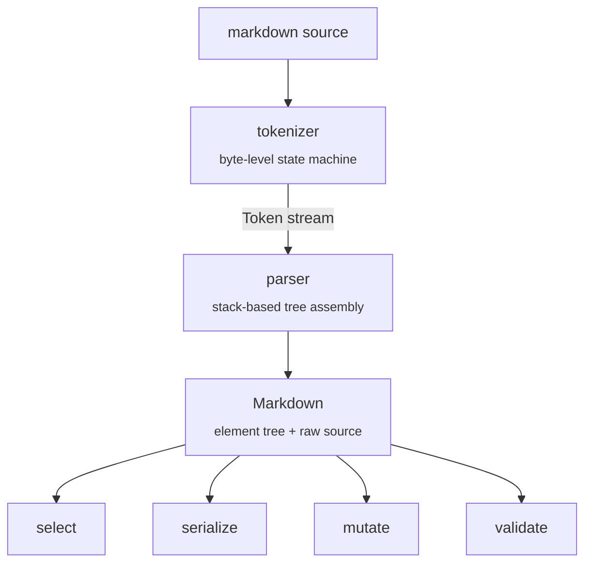
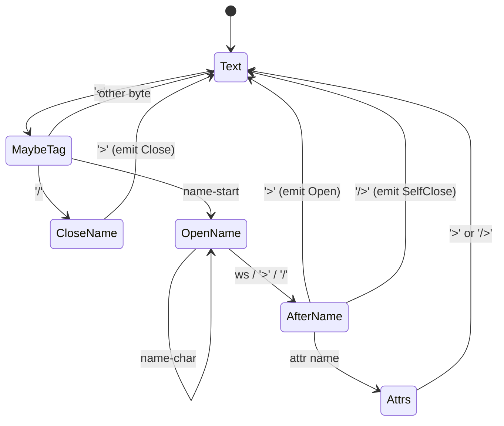

# Architecture

`marxml` is one Rust crate with two faces:

- The crate itself, published to crates.io.
- A napi-rs binding layer in `bindings/node/`, published to npm with prebuilt native `.node` binaries per platform.

Both expose the same conceptual surface — parse, select, mutate, serialize, validate — adapted to each language's idioms. The Rust API mirrors `scraper`'s shape; the Node API materializes results into JS-friendly object trees instead of borrowed references.

## Pipeline



The crate is layered so each stage is independently testable, and so the Node binding can stop at any level (e.g. `parse` returns a fully materialized JS object; `select` runs the same Rust matcher and materializes a `Vec<Element>` for JS).

## Tokenizer

A linear, byte-level state machine over the input string. Scans for `<` followed by a name-start byte (letter or `_`), branches on whether it sees `/` for a close tag, then reads:



- **Byte-level**, not character-level. UTF-8 multi-byte sequences pass through transparently in attribute values and content; their continuation bytes are always `>= 0x80` so they can't conflict with the ASCII syntax bytes (`<`, `>`, `"`, `/`, `=`).
- **Lone `<` survives.** Prose like `x < 3` passes through unmolested because the tokenizer only commits to parsing a tag when `<` is followed by name-start or `/name-start`. Everything else stays as opaque text.
- **One pass, no backtracking.** Each byte is visited at most twice (once during text scanning, again during tag body parsing). No regex compilation, no allocation per token beyond the owned `String`s for tag/attr names and attr values.

## Parser

Stack-based tree assembler. Walks the token stream from the tokenizer:

- `Open { name, attrs, body_start }` → push a frame on the stack.
- `SelfClose { name, attrs }` → emit an `ElementData` immediately. Children list is empty; content range is zero-width.
- `Close { name, body_end }` → pop the top frame. If the name doesn't match the popped frame's name, emit `ParseError::MismatchedClose`. If the stack is empty, emit `ParseError::StrayClose`. Otherwise finalize the popped frame as an `ElementData` with `body_start..body_end` as its content range.

Per-tag duplicate-`id` detection runs at finalize time: each tag name has its own `HashSet<id>`, and any second insertion produces `ParseError::DuplicateId`. The plan called this out explicitly — `<task id="x"/><phase id="x"/>` is fine; `<task id="x"/><task id="x"/>` isn't.

At EOF, any frames left on the stack become `ParseError::UnclosedTag` errors.

The element tree is rooted at `Markdown::roots: Vec<ElementData>`. Each `ElementData` owns its tag name, attribute pairs, content byte range (into `Markdown::raw`), span, and recursive `children: Vec<ElementData>`. Callers interact through `ElementRef<'a>`, a `Copy` pair of `(&ElementData, &str)` (the raw buffer).

## Selector

CSS3 subset, hand-rolled recursive descent parser.

```
selector  := compound ( "," compound )*
compound  := simple ( combinator simple )*
combinator:= whitespace            (descendant)
          | ws? ">" ws?            (direct child)
simple    := ( tag | "*" )? predicate*
predicate := "[" name ( ( "=" | "^=" | "$=" | "*=" ) quoted )? "]"
          | ":" pseudo
pseudo    := "first-child"
          | "nth-child(" digits ")"
          | "not(" simple ")"
```

A compound is stored as a `subject` (the rightmost simple) plus a `prefix` of `(combinator, simple)` pairs walking *right-to-left*. The matcher walks the prefix that way too: for each ancestor in the candidate's path, it checks whether the next prefix entry matches.

Tag-less attribute selectors (`[id]`) and tag-less pseudos inside `:not()` work because `parse_simple` accepts an implicit universal target when no tag is given.

The matcher does a depth-first walk, maintaining a stack of `(NodeCtx, sibling_index)` so `:first-child` and `:nth-child(n)` can read the position cheaply. Matches are deduplicated by `*const ElementData` pointer identity so a union like `task, *` doesn't yield duplicates.

## Mutation

The mutation API is intentionally not an AST rewriter. The three methods (`update`, `replace_content`, `replace_in`) operate on byte ranges in the raw source:

1. Run the selector to identify matching elements.
2. Compute the byte range to splice for each match.
3. Sort splices by *descending* start offset so earlier mutations don't shift later positions.
4. Apply replacements in that order on a fresh `String` clone of the raw.

Why string-splicing instead of AST rewrite + re-serialize?

- **Byte-for-byte preservation of untouched content.** This was the explicit goal — markdown formatting, comments, whitespace, anything outside the touched elements survives the round trip exactly.
- **No need to "render" elements that didn't change.** Mutations stay local.
- **Cheaper than re-walking and re-emitting.** A single contiguous `String::replace_range` is fast.

The downside: mutations don't update the in-memory tree. If you want to chain mutations you re-parse the returned string. For the agent-state-machine use case this is the right trade — most mutations are followed by writing to disk.

## Validation

`validate(&Markdown, &Schema) -> ValidationReport` walks the tree once, looking up each visited tag in `Schema::tags`. For matched tags, it checks (in order):

1. Required attributes present.
2. Present attribute values satisfy the kind constraint (`String`/`Enum`/`Regex`).
3. Required children present.
4. Children outside the allowlist (only when `exclusive_children` is opted in).
5. Content non-empty (when `content_required` is set).

Validation accumulates errors rather than short-circuiting — callers see every issue at once. Regex patterns are compiled at `Schema::build()` time so invalid patterns surface at startup, not on the first validation call.

## Two-track API

The Rust crate exposes borrowed views (`ElementRef<'a>`) so common reads are zero-copy. The napi-rs binding can't expose borrowed references across the FFI boundary safely — JS doesn't understand Rust's borrow checker — so the binding holds an opaque parsed handle and materializes `Element` POJOs on demand:

| Operation     | Rust                                  | Node                                          |
| ------------- | ------------------------------------- | --------------------------------------------- |
| Parse         | `parse(src) -> Markdown`              | `parse(src) -> MarkdownDoc` (factory POJO)    |
| Element view  | `ElementRef<'a>` (`Copy`, zero-alloc) | `Element` (POJO with `children: Element[]`)   |
| Query         | `doc.select(&sel) -> Iterator<...>`   | `doc.select(sel) -> Element[]`                |
| Mutate        | `doc.update(&sel, &[...]) -> String`  | `doc.updateAttrs(sel, [...]) -> string`       |
| Serialize     | `doc.to_xml(&opts) -> String`         | `doc.toXml(opts) -> string`                   |
| Validate      | `validate(&doc, &schema) -> Report`   | `doc.validate(schema) -> ValidationReport`    |

The binding layer is intentionally thin: a `#[napi]` class (`NativeMarkdown`) wrapping `marxml::Markdown`, plus a JS factory wrapper (`marxml.mjs`) that hides the class behind a POJO. Adding a new method means one `#[napi]` fn + one bound method in the wrapper. Per-method signatures and JSDoc auto-generate into `index.d.ts` from the Rust `///` doc comments.

## Distribution

- The Rust crate publishes to crates.io directly.
- The Node package uses napi-rs's `optionalDependencies` trick: the main `marxml` package depends on a set of platform-specific sub-packages (one `.node` binary each). npm/pnpm only installs the sub-package matching the host platform. Currently macOS (arm64, x64) + Linux (x64-gnu, x64-musl, arm64-gnu); Windows pending an npm spam-detection unblock (see [contributing/release.md → Platform coverage](../contributing/release.md#platform-coverage)).
- Per-platform sub-packages are generated by `napi create-npm-dirs` and live under `bindings/node/npm/<target>/`. The release workflow drops the corresponding `.node` artifact into each before publishing.

## Test layering

| Layer | Where | What |
| --- | --- | --- |
| Unit | `crates/marxml/src/**/*.rs` `#[cfg(test)] mod tests` | Internal helpers, state transitions |
| Integration | `crates/marxml/tests/*.rs` | Public API surface; `rstest` table cases |
| Fixture | `crates/marxml/tests/fixture_suite.rs` + `tests/fixtures/` | 30+ representative inputs, `insta::glob!` snapshots |
| Property | `crates/marxml/tests/proptest_parse.rs` | Round-trip + no-panic invariants |
| Binding | `bindings/node/__test__/*.test.ts` | vitest against the built `.node` |
| Doc tests | `cargo test --doc` | All public-doc examples |
| Bench | `crates/marxml/benches/parse_bench.rs` | criterion + CodSpeed |
